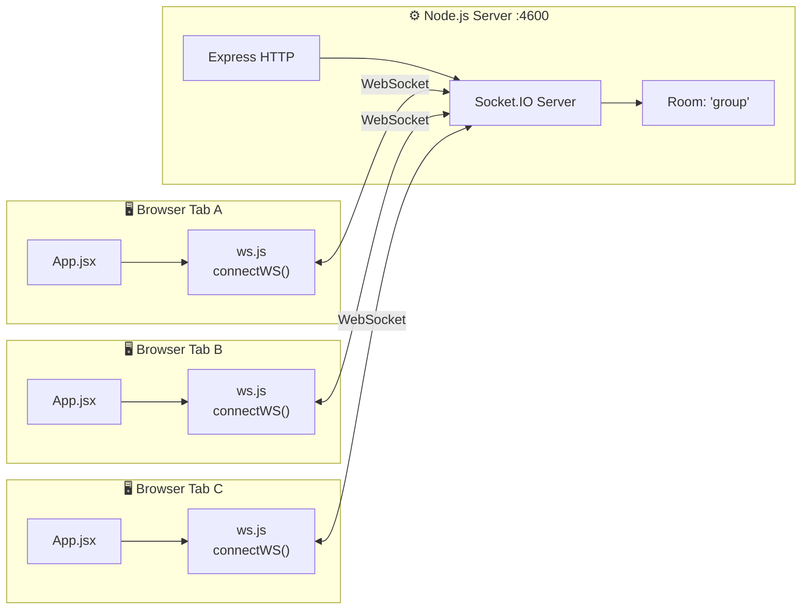
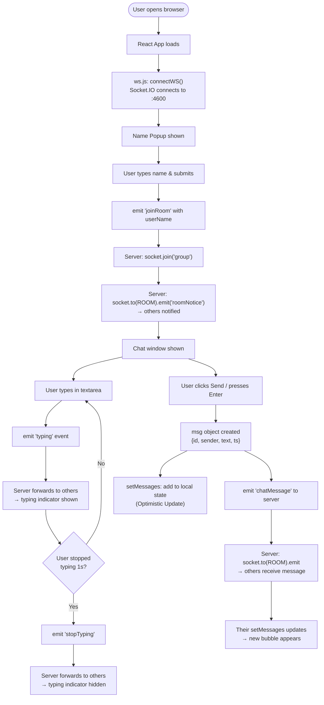

# 📦 WebSocket Group Chat — Project Overview

## 🧠 What Is This Project?

This is a **real-time group chat application** built with:

- **Frontend**: React (with Vite + TailwindCSS)
- **Backend**: Node.js + Express + Socket.IO
- **Communication**: WebSockets via Socket.IO

Multiple users can open the app in different browser tabs/windows and chat with each other in real-time. They can see who is typing live, and messages are delivered instantly without refreshing the page.

---

## 📁 Folder Structure

```
websocket-chat/
│
├── backend/                  ← Node.js + Express server
│   ├── server.js             ← Main server file (Socket.IO logic lives here)
│   ├── package.json          ← Backend dependencies
│   └── node_modules/
│
├── frontend/                 ← React app (Vite + TailwindCSS)
│   ├── index.html            ← HTML shell that mounts the React app
│   ├── package.json          ← Frontend dependencies
│   ├── vite.config.js        ← Vite build tool configuration
│   └── src/
│       ├── main.jsx          ← React app entry point
│       ├── App.jsx           ← Main component (entire UI + socket logic)
│       ├── ws.js             ← Socket.IO client connection helper
│       └── App.css           ← Minimal CSS overrides
│
├── test/                     ← Standalone raw WebSocket experiment
│   ├── index.js              ← Basic WebSocket server using 'ws' library
│   └── package.json
│
└── DOCS/                     ← 📘 You are here — learning documentation
```

---

## 🏗️ Architecture Diagram



---

## 🔄 How Real-Time Communication Works

### What is a WebSocket?
Normal HTTP: Browser asks → Server replies → Connection closes.  
WebSocket: Browser connects → **Connection stays open forever** → Both sides can send data at any time.

### What is Socket.IO?
Socket.IO is a library built **on top of WebSockets** that adds:
- Automatic reconnection
- Event-based messaging (like `emit` / `on`)
- Rooms (groups of sockets)
- Fallback to HTTP long-polling if WebSockets are not supported

### The Chat Flow (Step by Step)



---

## 🧰 Technology Stack

| Layer        | Technology         | Purpose                                  |
|--------------|--------------------|------------------------------------------|
| Frontend     | React 19           | UI components + state management         |
| Frontend     | Vite               | Fast dev server + build tool             |
| Frontend     | TailwindCSS v4     | Utility-first CSS styling                |
| Frontend     | socket.io-client   | WebSocket client library                 |
| Backend      | Node.js            | JavaScript runtime on the server         |
| Backend      | Express v5         | HTTP server framework                    |
| Backend      | Socket.IO v4       | WebSocket server with rooms and events   |
| Test         | ws library         | Raw WebSocket (used for learning basics) |

---

## 🚀 How to Run the Project

### Step 1: Start the Backend
```bash
cd backend
node server.js
# Server starts at http://localhost:4600
```

### Step 2: Start the Frontend
```bash
cd frontend
npm run dev
# Vite dev server starts (usually at http://localhost:5173)
```

### Step 3: Open Multiple Tabs
Open `http://localhost:5173` in **2 or more browser tabs** and start chatting!

---

## 📚 Key Concepts You Will Learn From This Project

1. **WebSockets** — persistent bidirectional communication
2. **Socket.IO Events** — `emit` (send) and `on` (receive)
3. **Socket.IO Rooms** — group sockets together to broadcast selectively
4. **React `useRef`** — holding mutable values (socket, timer) without re-renders
5. **React `useEffect`** — running side effects (connecting socket, registering listeners)
6. **Typing Indicators** — debouncing with `setTimeout` + `clearTimeout`
7. **Message State** — immutably updating arrays with React state

---

> Next: Read `02_BACKEND_GUIDE.md` to understand the server in detail.
