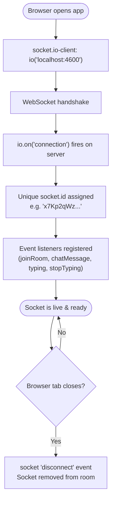
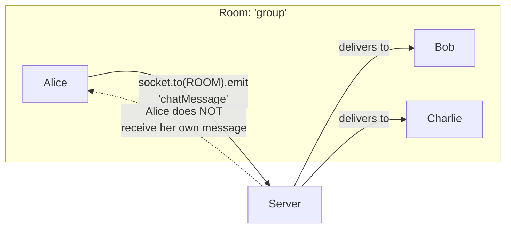
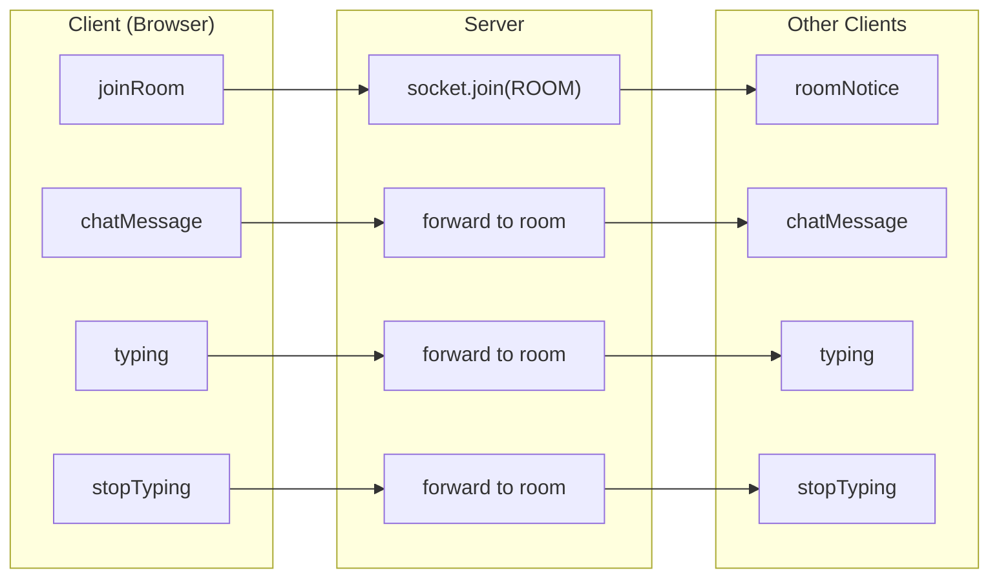

# 🖥️ Backend Deep Dive — server.js Explained

> File: `backend/server.js`  
> Purpose: Real-time chat server using Node.js, Express, and Socket.IO

---

## 📦 Dependencies

```json
{
  "express": "^5.1.0",
  "socket.io": "^4.8.1"
}
```

| Package    | What It Does                                                    |
|------------|-----------------------------------------------------------------|
| `express`  | Creates an HTTP server, handles normal GET/POST requests        |
| `socket.io`| Adds WebSocket support on top of the HTTP server               |

---

## 📄 Full File (with Line-by-Line Explanation)

```js
// 1. Import the native Node.js HTTP module
import { createServer } from "node:http";

// 2. Import Express — a minimal web framework for Node.js
import express from "express";

// 3. Import the Socket.IO Server class
import { Server } from "socket.io";
```

### Why do we need both `http` and `express`?
- `express` creates an **app** (handles HTTP routes)
- `createServer(app)` wraps it into a raw **HTTP server**
- Socket.IO then attaches to this raw HTTP server to upgrade connections to WebSockets

---

```js
const app = express();          // Create Express application
const server = createServer(app); // Wrap it in a raw HTTP server
```

---

```js
const io = new Server(server, {
  cors: {
    origin: "*",   // Allow requests from ANY domain (for development)
  },
});
```

**What is CORS?**  
Cross-Origin Resource Sharing. By default browsers block requests from one domain to another (e.g., `localhost:5173` → `localhost:4600`). Setting `origin: "*"` allows **all** origins — fine for development, should be restricted in production.

---

```js
const ROOM = "group";
```

A **room** in Socket.IO is a named channel. All users in the same room can receive broadcasts. Here we have one hardcoded room called `"group"`.

---

## 🔌 The Connection Handler

```js
io.on("connection", (socket) => {
  console.log("a user connected", socket.id);
  // ...event listeners go inside here
});
```

- `io.on("connection", ...)` fires every time a **new browser tab** connects to the server
- Each connection gets a unique `socket` object
- `socket.id` is a unique ID for that browser tab (e.g., `"AbCd1234..."`)

### Connection Lifecycle



---

## 📨 Event: `joinRoom`

```js
socket.on("joinRoom", async (userName) => {
  console.log(`${userName} is joining the group.`);
  await socket.join(ROOM);

  // Broadcast to everyone EXCEPT the joiner
  socket.to(ROOM).emit("roomNotice", userName);
});
```

**Step by step:**
1. Frontend emits `"joinRoom"` with the user's name
2. Server calls `socket.join(ROOM)` → adds this socket to the `"group"` room
3. `socket.to(ROOM).emit(...)` → sends the `"roomNotice"` event to **all OTHER sockets** in the room (the joiner does NOT receive this)

**Difference between `io.to()` and `socket.to()`:**

| Method            | Who receives it?                        |
|-------------------|-----------------------------------------|
| `io.to(ROOM).emit`  | Everyone in the room, **including** the sender |
| `socket.to(ROOM).emit` | Everyone in the room, **except** the sender |



---

## 💬 Event: `chatMessage`

```js
socket.on("chatMessage", (msg) => {
  socket.to(ROOM).emit("chatMessage", msg);
});
```

- Frontend emits `"chatMessage"` with a message object `{ id, sender, text, ts }`
- Server forwards it to **all other users in the room**
- The **sender adds their own message to their local state** immediately (no echo from server)

This is the "optimistic update" pattern — the sender doesn't wait for the server to echo back.

---

## ⌨️ Event: `typing`

```js
socket.on("typing", (userName) => {
  socket.to(ROOM).emit("typing", userName);
});
```

- When a user starts typing, frontend emits `"typing"` with their username
- Server forwards it to all others
- Other browsers show `"[userName] is typing..."` in the chat header

---

## 🛑 Event: `stopTyping`

```js
socket.on("stopTyping", (userName) => {
  socket.to(ROOM).emit("stopTyping", userName);
});
```

- When typing stops (after 1 second of inactivity), frontend emits `"stopTyping"`
- Server forwards it to others → they remove that user from the typing indicator

---

## 🌐 HTTP Route

```js
app.get("/", (req, res) => {
  res.send("<h1>Hello world</h1>");
});
```

A basic sanity-check route. Visit `http://localhost:4600` in a browser to confirm the server is running.

---

## 🚀 Starting the Server

```js
server.listen(4600, () => {
  console.log("server running at http://localhost:4600");
});
```

Starts listening on **port 4600**. All Socket.IO connections also go through this port.

---

## 🗺️ Complete Event Map



---

## 🧪 The `test/` Folder — Raw WebSocket Basics

The `test/index.js` file is a **simpler standalone experiment** using the raw `ws` package (without Socket.IO):

```js
import { WebSocketServer } from "ws";

const wss = new WebSocketServer({ server });

wss.on("connection", (ws) => {
  ws.on("message", (data) => {
    ws.send("Hello from the server!");   // Echo back to sender only
  });
});
```

**Difference from Socket.IO:**
- No rooms concept
- No event names — just raw binary/text frames
- Manual message routing needed
- No auto-reconnect

This exists as a learning scaffold to understand the raw protocol before using the higher-level Socket.IO abstraction.

---

> Next: Read `03_FRONTEND_GUIDE.md` to understand the React app in detail.
