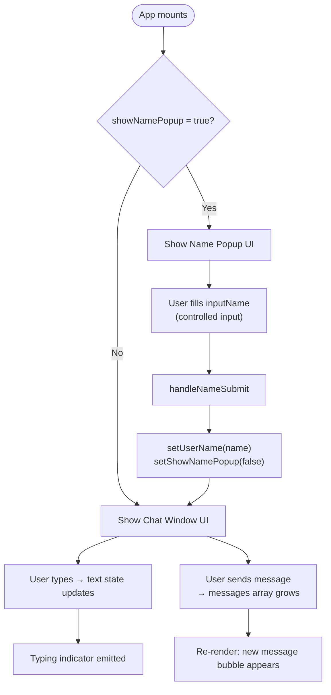
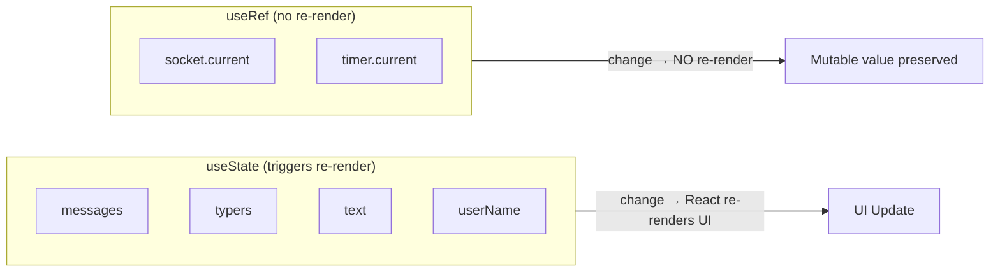
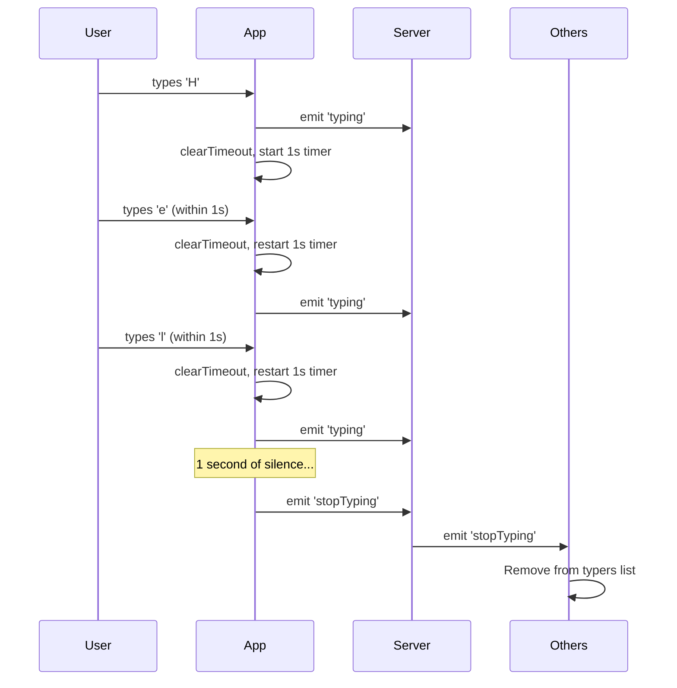
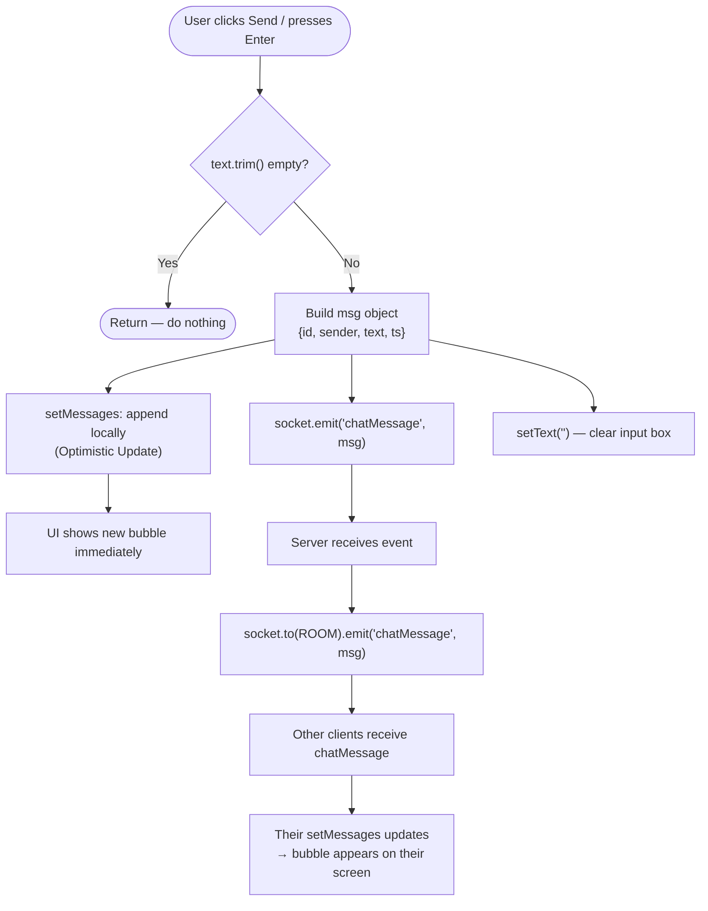

# ⚛️ Frontend Deep Dive — React App Explained

> Files: `frontend/src/App.jsx`, `frontend/src/ws.js`, `frontend/src/main.jsx`  
> Stack: React 19 + Socket.IO Client + TailwindCSS v4

---

## 📄 Entry Point — `main.jsx`

```jsx
import { StrictMode } from 'react';
import { createRoot } from 'react-dom/client';
import './app.css';
import App from './App.jsx';

createRoot(document.getElementById('root')).render(
    <App />
);
```

**What this does:**
1. Finds the `<div id="root">` in `index.html`
2. Mounts the React application tree into it
3. `StrictMode` is commented out (it causes effects to run twice in dev — was likely disabled to avoid double socket connections)

---

## 🔌 WebSocket Connector — `ws.js`

```js
import { io } from 'socket.io-client';

export function connectWS() {
    return io('http://localhost:4600');
}
```

- `io(url)` creates a **Socket.IO client** and connects to the server
- Returns the **socket instance** (used to `emit` and `on` events)
- Exporting as a function makes it easy to call it once and store the result in a `useRef`

---

## 🧩 Main Component — `App.jsx`

### 📦 State Variables

```jsx
const timer = useRef(null);      // Holds the setTimeout reference for "stop typing"
const socket = useRef(null);     // Holds the Socket.IO client instance

const [userName, setUserName]         = useState("");     // The current user's name
const [showNamePopup, setShowNamePopup] = useState(true); // Whether to show name entry screen
const [inputName, setInputName]       = useState("");     // Controlled input for name form
const [typers, setTypers]             = useState([]);     // List of users currently typing
const [messages, setMessages]         = useState([]);     // All chat messages
const [text, setText]                 = useState("");     // Controlled input for message box
```

**State & UI Flow:**



**Why `useRef` for `socket` and `timer`?**

`useRef` stores a value that:
- **Does NOT cause a re-render** when changed
- **Persists across re-renders**

If we used `useState` for the socket, every state update would potentially re-create the connection. `useRef` is the right tool when you need a "box" to hold a mutable value through the component's lifetime.



---

### 🔁 Effect 1 — Connect Socket & Register Listeners

```jsx
useEffect(() => {
  socket.current = connectWS();

  socket.current.on("connect", () => {
    socket.current.on("roomNotice", (userName) => {
      console.log(`${userName} joined to group!`);
    });

    socket.current.on("chatMessage", (msg) => {
      setMessages((prev) => [...prev, msg]);
    });

    socket.current.on("typing", (userName) => {
      setTypers((prev) => {
        const isExist = prev.find((typer) => typer === userName);
        if (!isExist) return [...prev, userName];
        return prev;
      });
    });

    socket.current.on("stopTyping", (userName) => {
      setTypers((prev) => prev.filter((typer) => typer !== userName));
    });
  });

  return () => {
    socket.current.off("roomNotice");
    socket.current.off("chatMessage");
    socket.current.off("typing");
    socket.current.off("stopTyping");
  };
}, []);
```

**Line by line:**

| Code | What it does |
|------|-------------|
| `connectWS()` | Creates + stores the socket connection |
| `.on("connect", ...)` | Waits until socket is confirmed connected before registering events |
| `.on("chatMessage", msg => ...)` | Receives incoming messages from OTHER users |
| `setMessages(prev => [...prev, msg])` | Immutable append — creates a new array instead of mutating |
| `.on("typing", userName => ...)` | Adds a user to the "currently typing" list (deduplication check) |
| `.on("stopTyping", userName => ...)` | Removes a user from the typing list using `.filter()` |
| `return () => { socket.current.off(...) }` | **Cleanup function** — removes listeners when component unmounts to prevent memory leaks |

**Why nest event listeners inside `.on("connect")`?**  
To guarantee the socket is fully connected before registering events. Avoids edge cases where events fire before the connection is ready.

---

### 🔁 Effect 2 — Typing Indicator (Debounce)

```jsx
useEffect(() => {
  if (text) {
    socket.current.emit("typing", userName);
    clearTimeout(timer.current);
  }

  timer.current = setTimeout(() => {
    socket.current.emit("stopTyping", userName);
  }, 1000);

  return () => {
    clearTimeout(timer.current);
  };
}, [text, userName]);
```

**This effect runs every time `text` changes (i.e., every keystroke).**

The logic implements a **debounce pattern**:



**Why `clearTimeout(timer.current)` before setting a new one?**  
Without clearing, multiple timers would stack up. Clearing ensures only one `stopTyping` fires — after the LAST keystroke.

---

### 🕐 Helper Function — `formatTime`

```jsx
function formatTime(ts) {
  const d = new Date(ts);
  const hh = String(d.getHours()).padStart(2, "0");
  const mm = String(d.getMinutes()).padStart(2, "0");
  return `${hh}:${mm}`;
}
```

- `ts` is a Unix timestamp in milliseconds (from `Date.now()`)
- Converts it to readable format like `"14:35"`
- `padStart(2, "0")` ensures single digits are zero-padded: `9` → `"09"`

---

### 📝 Function — `handleNameSubmit`

```jsx
function handleNameSubmit(e) {
  e.preventDefault();              // Don't reload the page
  const name = inputName.trim();   // Remove leading/trailing whitespace
  if (!name) return;               // Guard: no empty names

  socket.current.emit("joinRoom", name);  // Tell server to join the room
  setUserName(name);                       // Save name in state
  setShowNamePopup(false);                 // Hide the name popup → show chat
}
```

This is called when the user submits the name form. After joining, `showNamePopup` becomes `false` which conditionally renders the chat UI instead.

---

### 📤 Function — `sendMessage`

```jsx
function sendMessage() {
  const t = text.trim();
  if (!t) return;            // Don't send empty messages

  const msg = {
    id: Date.now(),          // Unique ID (used as React key)
    sender: userName,        // Who sent it
    text: t,                 // The message content
    ts: Date.now(),          // Timestamp for display
  };

  setMessages((m) => [...m, msg]);        // Add to local state immediately
  socket.current.emit("chatMessage", msg); // Send to server → others
  setText("");                             // Clear the input box
}
```

**Message Send Flow:**



**Key design choice — Optimistic Update:**  
The sender adds their own message to state **locally** without waiting for the server. The server does NOT echo messages back to the sender — it only forwards to others. This avoids duplicates and feels instant.

---

### ⌨️ Function — `handleKeyDown`

```jsx
function handleKeyDown(e) {
  if (e.key === "Enter" && !e.shiftKey) {
    e.preventDefault();
    sendMessage();
  }
}
```

- `Enter` alone → send the message
- `Shift + Enter` → allows new lines (default `textarea` behavior)
- `e.preventDefault()` prevents the newline from being inserted on plain Enter

---

## 🎨 UI Rendering

### Part 1 — Name Popup (shown first)

```jsx
{showNamePopup && (
  <div className="bg-pink-500 p-8 m-8 border-2 border-black rounded-2xl">
    <form onSubmit={handleNameSubmit}>
      <input
        type="text"
        placeholder="Enter your name to enter the chat"
        value={inputName}
        onChange={(e) => setInputName(e.target.value)}
      />
      <button type="submit">Enter</button>
    </form>
  </div>
)}
```

This is a **controlled form** — the `inputName` state is the single source of truth for the input's value.

---

### Part 2 — Chat Window (shown after name entry)

```jsx
{!showNamePopup && (
  <div className="w-full max-w-2xl h-[90vh] ...">
    {/* Header */}
    {/* Message list */}
    {/* Text input */}
  </div>
)}
```

#### Chat Header
```jsx
<div className="bg-gray-300 p-4 m-4 border-2 border-black rounded-2xl">
  welcome to realtime group chat
  {typers.length ? (
    <p>{typers.join(", ")} is typing...</p>
  ) : (
    <p></p>
  )}
  <p>signed in as {userName}</p>
</div>
```

- `typers.join(", ")` → if Alice and Bob are typing: `"Alice, Bob is typing..."`

#### Message List

```jsx
{messages.map((m) => {
  const mine = m.sender === userName;   // Is this my message?
  return (
    <div key={m.id} className={`flex ${mine ? "justify-end" : "justify-start"}`}>
      <div className={`... ${mine
        ? "bg-[#DCF8C6] rounded-br-2xl"   // Green bubble (right-aligned, mine)
        : "bg-white rounded-bl-2xl"        // White bubble (left-aligned, theirs)
      }`}>
        <div>{m.text}</div>
        <div>
          <span>{m.sender}</span>
          <span>{formatTime(m.ts)}</span>
        </div>
      </div>
    </div>
  );
})}
```

- Uses `m.id` as the React `key` for efficient list diffing
- Conditionally aligns and colors messages based on `mine`
- The green color `#DCF8C6` is the classic WhatsApp message bubble color

#### Text Input Area

```jsx
<textarea
  rows={1}
  value={text}
  onChange={(e) => setText(e.target.value)}
  onKeyDown={handleKeyDown}
  placeholder="Type a message..."
/>
<button onClick={sendMessage}>Send</button>
```

---

## 🧠 React Hooks Used — Summary

| Hook        | Used For                                              |
|-------------|-------------------------------------------------------|
| `useState`  | Managing UI state (messages, typers, name, text etc.) |
| `useRef`    | Storing socket + timer without triggering re-renders  |
| `useEffect` | Running side effects (connecting socket, debounce)    |

---

## 🔑 Key Patterns in This Code

| Pattern | Where | Why |
|---------|-------|-----|
| Optimistic Update | `sendMessage()` | Instant feedback, no server echo needed |
| Debounce | `useEffect([text])` | Avoid spamming `typing` events per keystroke |
| Cleanup function | `useEffect` return | Prevent memory leaks from stale listeners |
| Controlled components | `<input>` / `<textarea>` | React state drives the UI, not the DOM |
| Functional state update | `setMessages(prev => ...)` | Safe async state updates without stale closures |

---

> Prev: `02_BACKEND_GUIDE.md`  
> Next: `04_CONCEPTS_GLOSSARY.md` for quick reference of all key terms.
