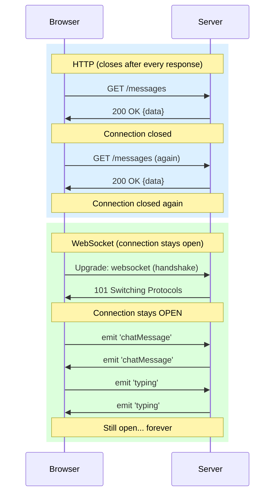
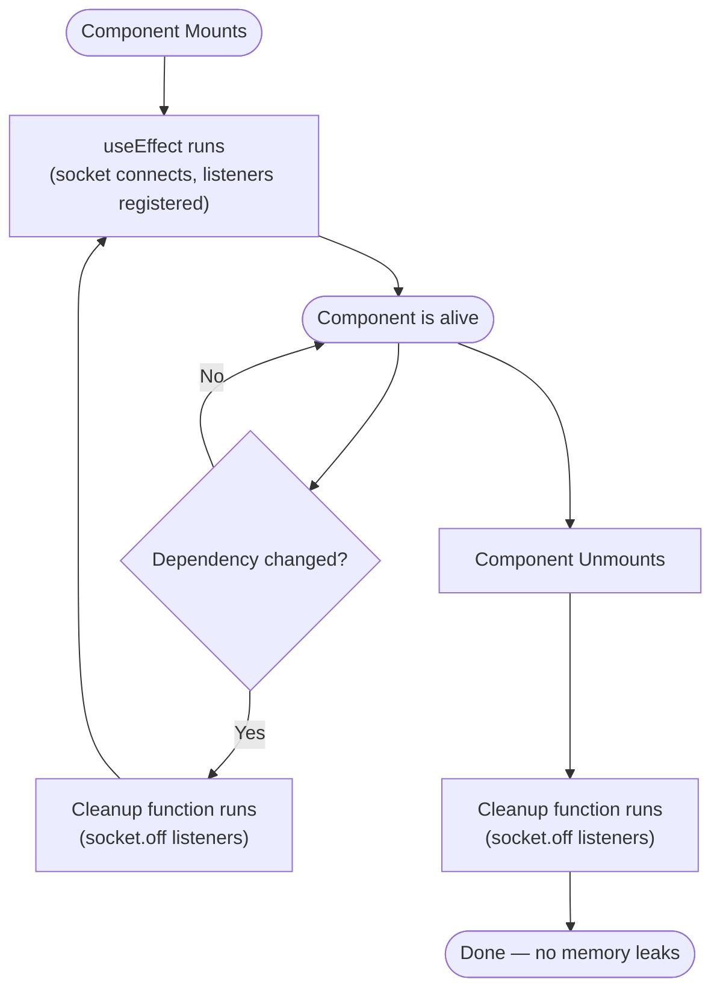

# 📖 Concepts Glossary & Quick Reference

> Quick lookup for every important term, concept, and pattern used in this project.

---

## 🌐 WebSocket vs HTTP

| Feature        | HTTP (Regular)              | WebSocket                          |
|----------------|-----------------------------|------------------------------------|
| Connection     | Opens and closes per request | Opens once, stays open             |
| Direction      | Client → Server only        | Client ↔ Server (both directions)  |
| Overhead       | High (headers every request)| Low (after handshake)              |
| Use case       | Loading pages, REST APIs    | Chat, live feeds, games, trading   |
| Protocol       | `http://` or `https://`     | `ws://` or `wss://`                |



---

## ⚡ Socket.IO

Socket.IO is a JavaScript library for real-time, bidirectional communication. It wraps WebSockets and adds:
- **Auto-reconnection** if connection drops
- **Event-based API** (`emit` / `on`) instead of raw frames
- **Rooms** for grouping sockets
- **Fallback** to HTTP polling if WebSockets are blocked

### Core API

```js
// SERVER SIDE
io.on("connection", (socket) => { ... });   // New client connected
socket.on("eventName", (data) => { ... });  // Listen for an event from client
socket.emit("eventName", data);             // Send to THIS client only
socket.to(ROOM).emit("eventName", data);    // Send to all in ROOM except this socket
io.to(ROOM).emit("eventName", data);        // Send to ALL in ROOM including this socket
socket.join(ROOM);                          // Add this socket to a room

// CLIENT SIDE
const socket = io("http://localhost:4600"); // Connect to server
socket.emit("eventName", data);             // Send event to server
socket.on("eventName", (data) => { ... });  // Listen for event from server
socket.off("eventName");                    // Remove a listener
```

---

## 🏠 Rooms

A room is a named group of sockets. When you `emit` to a room, all sockets in that room receive it.

```
Room: "group"
├── Socket A (Alice)
├── Socket B (Bob)
└── Socket C (Charlie)

Alice emits to room "group" → Bob and Charlie receive it (Alice does NOT if using socket.to())
```

---

## ⚛️ React Hooks

### `useState`
Stores values that, when changed, cause the component to re-render.

```jsx
const [count, setCount] = useState(0);
// count = current value
// setCount = function to update it
setCount(5);              // Set to 5
setCount(prev => prev + 1); // Functional update (safe in async contexts)
```

### `useRef`
Stores a mutable value that does NOT trigger a re-render when changed.

```jsx
const timerRef = useRef(null);   // Initial value is null
timerRef.current = setTimeout(...); // Mutate .current directly
```

Use `useRef` for:
- Socket instance
- Timer/interval IDs
- DOM element references

### `useEffect`
Runs side effects after render. Optionally returns a cleanup function.

```jsx
useEffect(() => {
  // Code runs after render
  const id = setInterval(() => console.log("tick"), 1000);

  return () => {
    // Cleanup: runs before next effect or when component unmounts
    clearInterval(id);
  };
}, [dependency]); // Re-run when 'dependency' changes
                  // [] = run once on mount only
                  // no array = run after every render
```



---

## 🔄 Key Patterns

### Optimistic Update
Add data to local state immediately without waiting for server confirmation.

```js
// Add message locally first
setMessages(prev => [...prev, msg]);
// Then send to server
socket.emit("chatMessage", msg);
```

**Pros:** Feels instant  
**Cons:** If server rejects, you need to roll back (not handled in this app)

---

### Debounce
Delay an action until after a pause in rapid events.

```js
clearTimeout(timer.current);            // Cancel previous timer
timer.current = setTimeout(() => {      // Start fresh timer
  socket.emit("stopTyping", userName);
}, 1000);                               // Fire after 1 second of silence
```

Used to prevent emitting `stopTyping` prematurely while the user is still typing fast.

---

### Controlled Components
React state is the single source of truth for an input's value.

```jsx
// UNCONTROLLED (bad for complex forms — DOM controls value)
<input defaultValue="hello" />

// CONTROLLED (React controls value)
const [text, setText] = useState("");
<input value={text} onChange={(e) => setText(e.target.value)} />
```

---

### Functional State Update
When updating state based on previous state, always use the functional form to avoid stale closures.

```jsx
// UNSAFE (may use stale 'messages' if update is async)
setMessages([...messages, newMsg]);

// SAFE (always gets the latest state)
setMessages(prev => [...prev, newMsg]);
```

---

### Immutable State Update
Never mutate state arrays or objects directly. Always return a new one.

```jsx
// WRONG
messages.push(newMsg);          // Mutates array — React won't detect the change
setMessages(messages);

// CORRECT
setMessages(prev => [...prev, newMsg]);  // Spread creates a new array
```

---

## 🏗️ Project-Specific Events Reference

| Event Name    | Direction       | Payload                          | Description                         |
|---------------|-----------------|----------------------------------|-------------------------------------|
| `joinRoom`    | Client → Server | `userName: string`               | User joins the chat room            |
| `roomNotice`  | Server → Others | `userName: string`               | Notify others someone joined        |
| `chatMessage` | Client → Server | `{id, sender, text, ts}`         | User sends a message                |
| `chatMessage` | Server → Others | `{id, sender, text, ts}`         | Deliver message to other users      |
| `typing`      | Client → Server | `userName: string`               | User started typing                 |
| `typing`      | Server → Others | `userName: string`               | Show typing indicator to others     |
| `stopTyping`  | Client → Server | `userName: string`               | User stopped typing                 |
| `stopTyping`  | Server → Others | `userName: string`               | Remove typing indicator for others  |

---

## 🔑 JavaScript Concepts Used

### `Array.prototype.find()`
```js
const isExist = prev.find((typer) => typer === userName);
// Returns the first element that matches, or undefined
```

### `Array.prototype.filter()`
```js
prev.filter((typer) => typer !== userName)
// Returns a new array excluding the matched item
```

### Spread Operator (`...`)
```js
[...prev, userName]      // Append to array
{ ...obj, key: value }   // Copy object with overridden key
```

### `String.prototype.padStart()`
```js
String(9).padStart(2, "0")   // → "09"
String(14).padStart(2, "0")  // → "14"
```

### Template Literals
```js
const name = "Alice";
console.log(`${name} joined!`);   // → "Alice joined!"
```

### `async/await`
```js
// socket.join() returns a Promise, so we await it
await socket.join(ROOM);
```

---

## 📁 File Reference

| File | Role |
|------|------|
| [`backend/server.js`](file:///c:/Users/USER/OneDrive/Desktop/web_sockets/websocket-chat/backend/server.js) | Socket.IO server — handles all events and rooms |
| [`frontend/src/ws.js`](file:///c:/Users/USER/OneDrive/Desktop/web_sockets/websocket-chat/frontend/src/ws.js) | Creates and returns the socket.io-client connection |
| [`frontend/src/App.jsx`](file:///c:/Users/USER/OneDrive/Desktop/web_sockets/websocket-chat/frontend/src/App.jsx) | Main React component — all UI + socket event logic |
| [`frontend/src/main.jsx`](file:///c:/Users/USER/OneDrive/Desktop/web_sockets/websocket-chat/frontend/src/main.jsx) | React app entry point — mounts App into the DOM |
| [`frontend/index.html`](file:///c:/Users/USER/OneDrive/Desktop/web_sockets/websocket-chat/frontend/index.html) | HTML shell with `<div id="root">` for React to mount into |
| [`test/index.js`](file:///c:/Users/USER/OneDrive/Desktop/web_sockets/websocket-chat/test/index.js) | Raw WebSocket experiment using the `ws` library |
